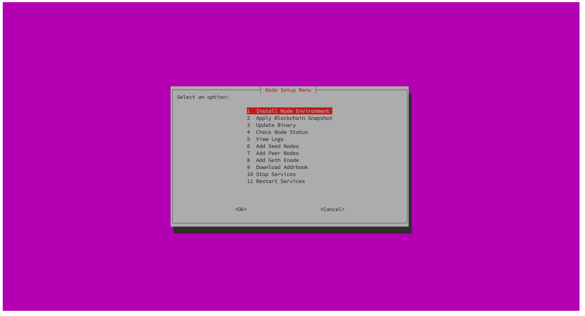
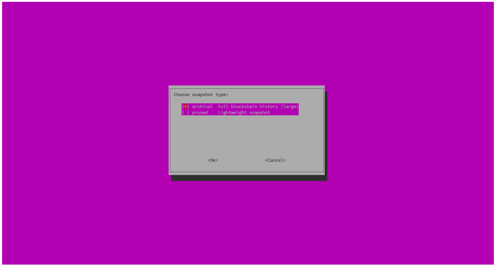
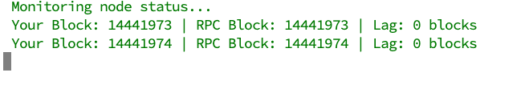
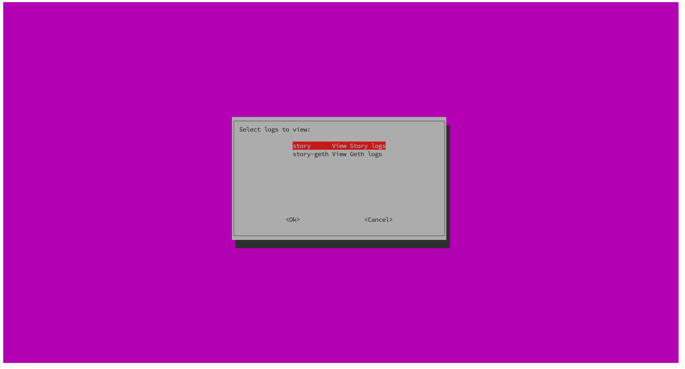

# story-installer-tui

A one liner Terminal User Interface to install and manage Story Protocol Node and Services
This script provides an interactive interface for managing **Story** and **Geth** nodes. It offers options to install dependencies, download snapshots, update binaries, monitor node status, and manage services efficiently using `whiptail` menus.
----

## Features Overview

| **Feature**                      | **Description**                                                                                               |
|----------------------------------|---------------------------------------------------------------------------------------------------------------|
| **Install Node Environment**     | Installs dependencies, downloads Story and Geth binaries, and sets up systemd service files.                  |
| **Apply Blockchain Snapshot**    | Downloads and extracts either **archival** or **pruned** snapshots for Story and Geth nodes.                  |
| **Update Binary**                | Updates Story or Geth binaries and restarts the respective services.                                          |
| **Check Node Status**            | Monitors synchronization by comparing block height with an RPC endpoint and displays the lag.                 |
| **View Logs**                    | Displays real-time logs for Story or Geth nodes using `journalctl`.                                           |
| **Add Seed Nodes**               | Adds predefined seed nodes to the Story node configuration.                                                   |
| **Add Peer Nodes**               | Fetches peers from the RPC endpoint and adds them to the persistent peer list.                                |
| **Add Geth Enode**               | Adds a new Geth enode to the running node via IPC.                                                            |
| **Download Addrbook**            | Downloads the latest addrbook for the Story node from the provided URL.                                       |
| **Stop Services**                | Stops Story and Geth services.                                                                                |
| **Restart Services**             | Restarts Story and Geth services.                                                                             |

## Visual Overview

Here is a visual representation of the key menus and interfaces provided by the script:

### Main Menu
  
The main menu allows you to navigate through the core features like installing the node, applying snapshots, updating binaries, and monitoring the node status.

### Snapshot Menu
  
This menu offers the option to choose between **archival** and **pruned** snapshots, helping you manage the blockchain data size efficiently.

### Monitor Node Status
  
This screen provides real-time information on your node's block height compared to the RPC endpoint, displaying any lag in blocks.

### View Logs
  
Select which logs you want to monitor in real-time—either the **Story** node or **Geth** node logs, making it easier to debug and monitor your services.
---

## Prerequisites

Make sure the following dependencies are installed:

`sudo apt update && sudo apt install -y curl git wget jq lz4 whiptail build-essential`

---

## Usage

1. Clone or copy the script to your local machine.
2. Ensure the script is executable:

`chmod +x node_setup.sh`

3. Run the script:

`./node_setup.sh`

---

## Variables Configuration

These are the key variables used in the script:

`GO_VERSION="1.23.1"`

`GO_BINARY_URL="https://dl.google.com/go/go${GO_VERSION}.linux-amd64.tar.gz"`

`GETH_BINARY_URL="https://github.com/piplabs/story-geth/releases/download/v0.9.4/geth-linux-amd64"`

`STORY_BINARY_URL="https://story-geth-binaries.s3.us-west-1.amazonaws.com/story-public/story-linux-amd64-0.11.0-aac4bfe.tar.gz"`

**Snapshot URLs:**

- **Archival:**
    - Geth: `https://snapshot.encapsulate.xyz/story/archive/story_geth_snapshot_archive.lz4`
    - Story: `https://snapshot.encapsulate.xyz/story/archive/story_snapshot_archive.lz4`

- **Pruned:**
    - Geth: `https://snapshot.encapsulate.xyz/story/pruned/story_geth_snapshot_pruned.lz4`
    - Story: `https://snapshot.encapsulate.xyz/story/pruned/story_snapshot_pruned.lz4`

`ADDRBOOK_URL="https://snapshot.encapsulate.xyz/story/addrbook.json"`

**Seeds and Enode:**

`SEEDS="seed1@encapsulate:26656, seed2@encapsulate:26656"`

`ENODE="enode://example@host:30303"`

**RPC Endpoint:**

`RPC_ENDPOINT="https://testnet.storyrpc.io"`

**System Services:**

`STORY_SERVICE="story"`

`GETH_SERVICE="story-geth"`

---

## Example Whiptail Menu

This is an example of how the interactive whiptail menu is implemented in the script:

`OPTION=$(whiptail --title "Node Setup Menu" --menu "Select an option:" 20 78 11 \
"1" "Install Node Environment" \
"2" "Apply Blockchain Snapshot" \
"3" "Update Binary" \
"4" "Check Node Status" \
"5" "View Logs" \
"6" "Add Seed Nodes" \
"7" "Add Peer Nodes" \
"8" "Add Geth Enode" \
"9" "Download Addrbook" \
"10" "Stop Services" \
"11" "Restart Services" 3>&1 1>&2 2>&3)`

If the user cancels, the script will exit gracefully:

`if [ $? != 0 ]; then exit_script; fi`

---

## Error Handling

- **Graceful Exit:** If the user cancels a menu, the script exits with a message.
- **Service Errors:** Any issues during service operations are caught and handled with prompts.

---

## Example Commands

To start the script, run:

`./node_setup.sh`

Choose an option from the menu and follow the prompts. For example:

- Select **Install Node Environment** to set up the necessary binaries and services.
- Choose **Apply Blockchain Snapshot** to sync your node with a recent snapshot.

---

## License

This script is provided by **Encapsulate** to help manage Story and Geth nodes efficiently. Use it freely to streamline your node operations.

---

This **README.md** provides everything needed to understand and use the script effectively. If you have any questions, feel free to reach out for assistance.